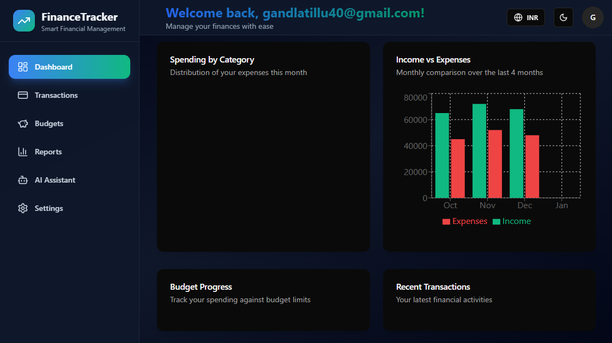
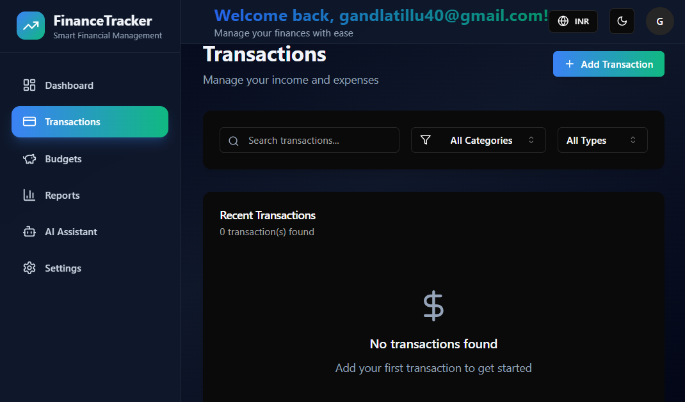
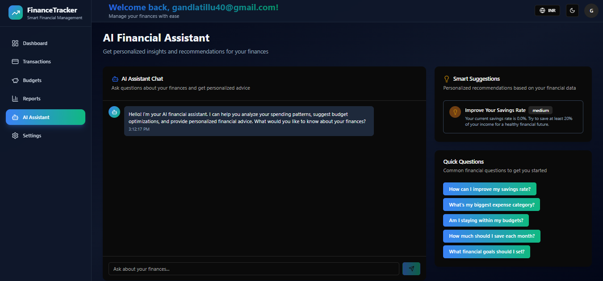
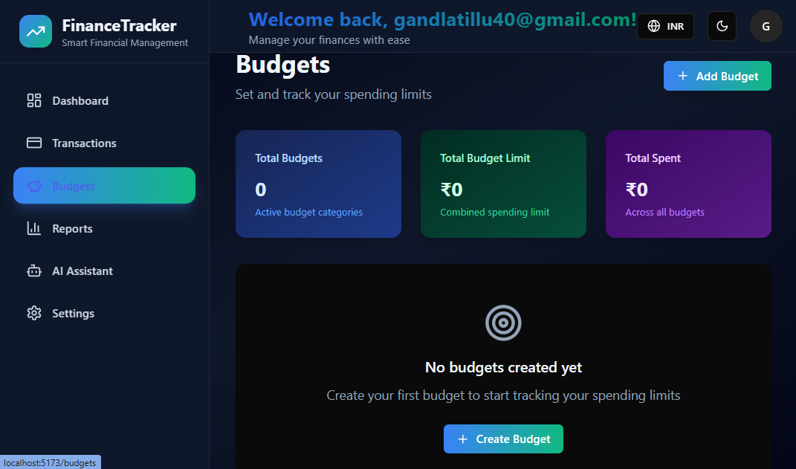
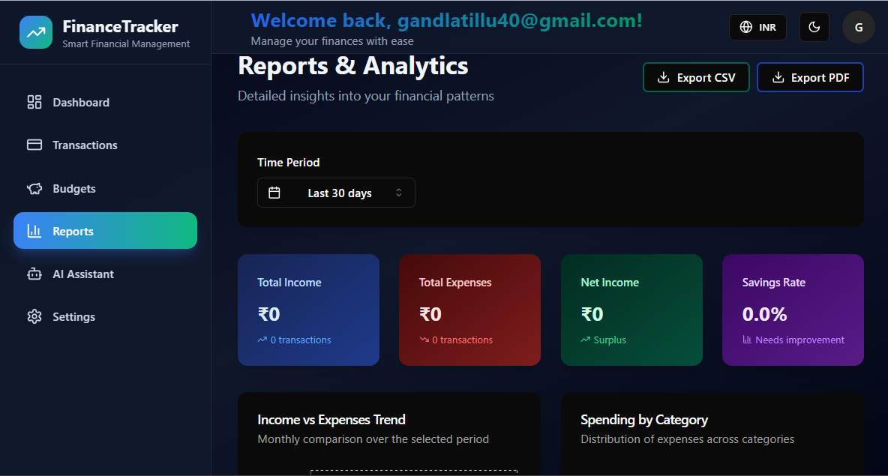

# 💼 Smart Finance Tracker 💡

AI-powered personal finance tracker that helps users manage their expenses, track income, and get smart suggestions to improve budgeting habits.

---

## 🧠 AI Smart Suggestions

Leverages AI to:
- Recommend financial goals based on income & history

---

## 🚀 Features

- 📊 Track income and expenses by category
- 📅 Monthly and weekly summaries
- 💡 AI-based smart budgeting suggestions
- 📈 Visual analytics (charts, graphs)
- 📂 Export reports in PDF/CSV
- 🛡️ Secure authentication
- 🔔 Expiry alerts for budget limits or high spending

---

## 🖼️ Screenshots

> Place your images inside a `screenshots/` folder in your root directory.

*login page*

*Dashboard Overview*

*Add New Transaction*

*AI Smart Budgeting*

*Budjets page*

*reports overview*

---

## 🛠️ Tech Stack

- **Frontend:** React, Tailwind CSS, Vite
- **Backend:** Node.js, Express
- **Database:** MongoDB
- **AI Layer:** OpenAI API or ML Model
- **Authentication:** JWT
- **PDF Generation:** html-pdf / jsPDF

---

## 🚫 License

This project is proprietary. You **may not copy, publish, host, or re-upload** any part of this project (including to GitHub or similar platforms) without written permission.

---

## 📌 Project Status

✅ Feature-complete  
🧪 Actively tested  
📦 Ready for deployment

---

## 🙋‍♂️ Author

**Gandla Aravind**  
📧 aravindgandla40@gmail.cm 
🌐 [GitHub](https://github.com/GANDLA-ARAVIND)
